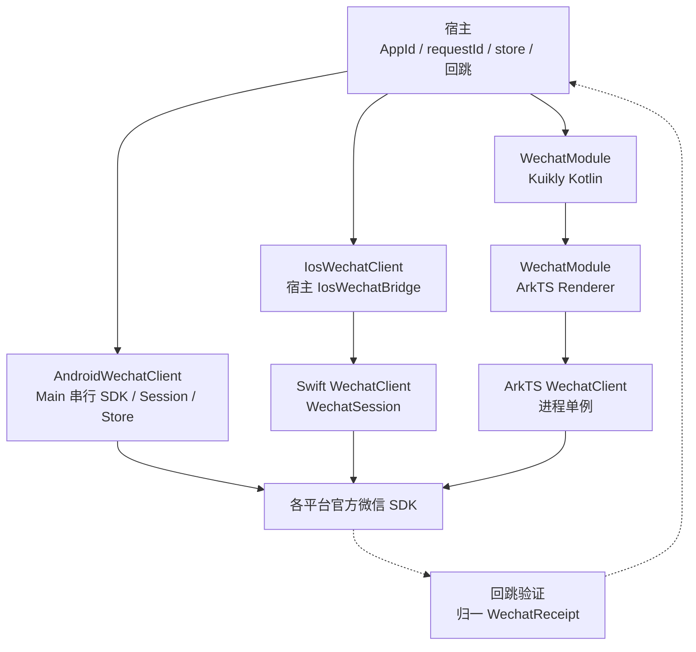
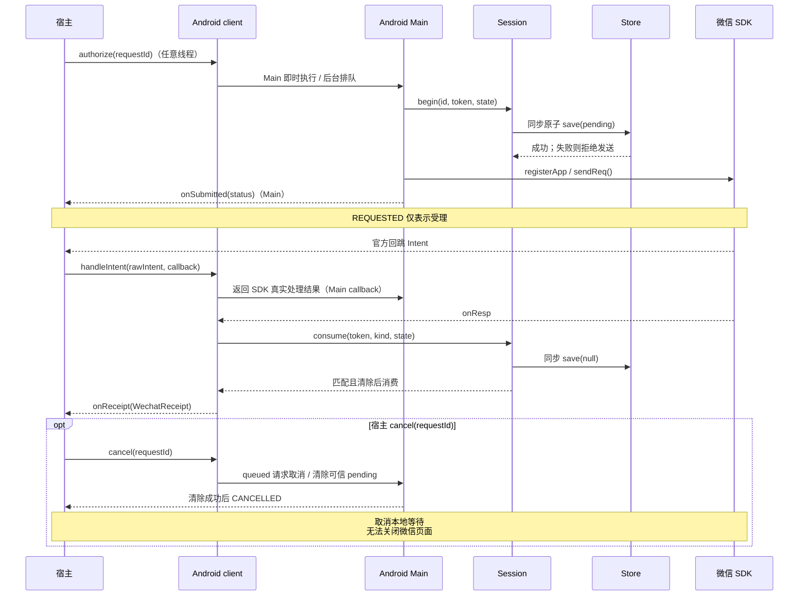
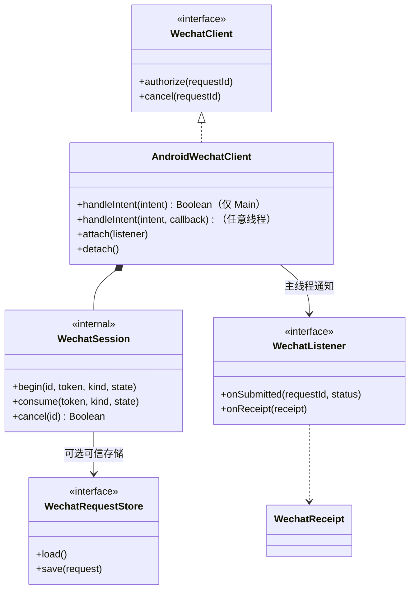

# GY CrossKit Wechat

微信 SDK 的 OAuth 授权、图片/网页分享和商家转账确认页入口，提供请求受理状态与 SDK 回执。账号换票、分享任务、订单查询及凭据由宿主负责；转账页面 `success` 不表示资金到账。

Maven **0.1.5** 已发布 [prerelease](https://github.com/gycrosskit/wechat/releases/tag/0.1.5)，修复 Android 后台入口、取消及迟回执归属；SDK、可信存储、状态和 listener 回调串行到 Main。Release 归档重下载 SHA 与 JitPack 全制品审计通过；精确合并提交、校验值、渠道限制及独立消费状态见[0.1.5 验收](docs/0.1.5远程发布验收.md)。本轮未修改 OHOS 原生协议，配套 HAR 继续固定 **0.1.4**（旧 0.1.3 不支持取消 ack）；Swift Package / Git Pod 继续使用已验 **0.1.3**。历史结果见[0.1.4 远程验收](docs/0.1.4远程发布验收.md)。

## 架构与调用流程

宿主在隐私准入后持有进程级原生 client，并转发官方 SDK 回跳；请求受理与业务回执分开。可信 pending 存储由宿主提供，不能从外部回跳重建授权资格。



下面是 Android OAuth 的关键流程；Android/OHOS 回执校验 transaction、kind 和 OAuth state。iOS OAuth 以 state 关联，分享没有 SDK transaction，只有本地单笔候选，不能沿用图中的 Android 归属证明。



类型图聚焦 Kotlin Android 链路，`WechatSession` 是内部单笔 pending 状态；监听器分别接收受理与回执。iOS 已发送分享后取消会隔离该实例后续分享。Kuikly `dispose()` 移除页面监听和 callback，原生 client 仍为进程级实例；取消是否成功必须等待同版原生确认。



源码入口：[公共契约与回执](wechat-core/src/commonMain/kotlin/io/github/gycrosskit/wechat/WechatClient.kt)、[Android SDK 接线](wechat-core/src/androidMain/kotlin/io/github/gycrosskit/wechat/AndroidWechatClient.kt)、[Kotlin pending](wechat-core/src/commonMain/kotlin/io/github/gycrosskit/wechat/WechatSession.kt)、[iOS KMP 桥](wechat-core/src/iosMain/kotlin/io/github/gycrosskit/wechat/IosWechatClient.kt)、[Swift client](iosApp/Sources/GycWechatNative/WechatClient.swift)、[Swift 分享隔离](iosApp/Sources/GycWechatNative/WechatSession.swift)、[Kuikly 取消确认与 dispose](wechat-kuikly/src/commonMain/kotlin/io/github/gycrosskit/wechat/kuikly/WechatModule.kt)、[OHOS client](ohos/wechat-native/src/main/ets/WechatClient.ets)。指定联系人图片分享只有 Android 实现，iOS/OHOS 返回不支持；转账页回执不是到账证明。

## 支持范围

| 入口 | 平台要求 | 厂商依赖 |
| --- | --- | --- |
| `wechat-core` | Android API 24；iOS 15；OHOS KMP 桥 | Android 微信 SDK 6.8.34；iOS 使用原生桥 |
| `GycWechatNative` | iOS 15，Swift / Git Pod | WechatOpenSDK-XCFramework 2.0.7 |
| `@gycrosskit/wechat-native` | HarmonyOS API 22 | @tencent/wechat_open_sdk 1.0.23 |
| `wechat-kuikly` | OHOS Kuikly Module | Kuikly core 2.28.0-2.0.21-ohos、render 2.28.0 |

KMP 使用 Kotlin **2.2.21-1.0.0** OHOS 工具链。KMP 产物和 HAR 是独立渠道；KMP 依赖不能代替原生 SDK 注册、回跳与签名配置。

## 安装

Gradle 仓库与依赖：

```kotlin
// settings.gradle.kts：保留已有 google() / mavenCentral()
dependencyResolutionManagement {
    repositories {
        google()
        mavenCentral()
        maven("https://jitpack.io") { content { includeGroup("com.github.gycrosskit.wechat") } }
        maven("https://maven.eazytec-cloud.com/nexus/repository/maven-public/")
        maven("https://mirrors.tencent.com/nexus/repository/maven-public/")
        exclusiveContent {
            forRepository {
                maven { url = uri("https://mirrors.tencent.com/nexus/repository/maven-tencent/") }
            }
            filter { includeGroup("com.tencent.kuikly-open") }
        }
    }
}
// commonMain.dependencies
implementation("com.github.gycrosskit.wechat:wechat-core:0.1.5")
// OHOS Kuikly 宿主额外添加：
implementation("com.github.gycrosskit.wechat:wechat-kuikly:0.1.5")
```

iOS 选择 Git Pod，或 Xcode 的 Swift Package：

```ruby
pod 'GycWechatNative', :git => 'https://github.com/gycrosskit/wechat.git', :tag => '0.1.3'
```

Swift Package URL 为 `https://github.com/gycrosskit/wechat.git`，精确版本 `0.1.3`，产品 `GycWechatNative`。Package 不包含微信 binaryTarget，宿主仍需提供并链接官方 XCFramework；Git Pod 会安装精确版本厂商依赖，未发布到 CocoaPods Specs。

HarmonyOS 0.1.4 的 OHPM `next` 发布已接受并 under review；精确版本查询仍为 NOTFOUND，Registry 安装尚未通过。以下命令仅在审核上架后使用。审核期间可按 Release SHA 固定下载独立原生包：

```sh
ohpm install @gycrosskit/wechat-native@0.1.4
```

[Release](https://github.com/gycrosskit/wechat/releases/tag/0.1.4) 已提供 `WechatNative.har` 和 SHA-256，供校验及文件依赖使用；不要以旧 0.1.0 替代新增 API。

## 最小接入

Android 在隐私准入后构造并持有一个进程级客户端；构造及 Unit 入口允许后台调用，SDK 与 store 在 Main 懒初始化：

```kotlin
import io.github.gycrosskit.wechat.AndroidWechatClient
import io.github.gycrosskit.wechat.WechatScene

val client = AndroidWechatClient(application, appId, listener, trustedStore)
client.authorize(uniqueRequestId) // 返回不保证已发送；等待 Main onSubmitted(REQUESTED)。
// 普通好友分享；requestId 每次调用唯一，不复用。
client.shareImage(anotherUniqueRequestId, imageBytes, WechatScene.SESSION)
```

上述类型来自 `wechat-core`，完整包名、监听器、store 与平台示例见[接入指南](docs/接入指南.md)。宿主必须实现 `{applicationId}.wxapi.WXEntryActivity`，在 Main `onCreate/onNewIntent` 把原始 Intent 交给同一实例的同步 `handleIntent(intent): Boolean` 并结束 Activity；后台接入使用 `handleIntent(intent) { handled -> ... }`，callback 在 Main 返回 `Result<Boolean>`，成功值为真实 SDK Boolean，失败为异常；授权字段只能由官方 SDK 验证。还需配置 INTERNET、开放平台包名和签名。

iOS 持有唯一 `WechatClient`，把 URL Scheme / Universal Link 交给 `handleOpenURL` / `handleUniversalLink`；宿主配置 Info.plist、Associated Domains 与 AASA。KMP 使用导出的 `IosWechatBridge`，参考 [Swift 适配示例](iosApp/KmpWechatBridge.swift)。

OHOS 在 EntryAbility 配置 `WechatClient.configure(appId, context, trustedStore)` 并交回跳 Want；初始化前可调用 `forwardWant`。Kuikly 两端注册 `GycWechat` Module，页面释放时调用 `dispose()`，原生监听对应移除。

## 必须了解的边界

- Android 构造、授权、分享、转账、取消与 attach/detach 允许任意线程；主线程即时执行，后台排队，图片计算仍在专用 imageExecutor。Unit 返回不代表 SDK 受理；同步 Boolean `handleIntent` 仍限定 Main，兼容旧 false 表示未处理（含 SDK 异常），后台必须使用 callback 重载，不阻塞等待。
- Android Main 取消尚未执行的入队请求后，该请求不会打开微信。`cancel` 返回不保证清除；存储清除失败保留 pending/owner，不伪造 CANCELLED 或 FAILED 终态，未知 ID 不通知终态。无 owner 的回执支持晚监听；有 owner 的迟回执只交给同一 listener（detach 后重新 attach 也可回放），新 listener 不接旧 owner 结果。
- `REQUESTED` 只表示 SDK 受理。Android/OHOS 按 transaction、类型和 OAuth state 验证回执；iOS 分享没有 transaction，`requestId == nil`，`SINGLE_PENDING` 只是当前单笔任务的本地候选，不能当成 SDK 准确关联或资金凭据。
- iOS 分享在回执前保持 `BUSY`；SDK 已发送后取消，会隔离本实例后续分享并返回 `UNSUPPORTED`，防止迟回执误认。不得在同进程重建客户端绕过；OAuth 与转账仍可使用。
- 冷启动恢复需要宿主提供同步原子可信 store，发送前保存、消费/取消前清除。不能从 Intent/Want/URL 生成恢复记录；iOS 只恢复 OAuth。归一回执的迟监听缓存仅限当前进程，业务服务端仍需兜底。
- 图片最大 25 MiB，缩略图最大 32 KiB；Android 大于 10 MiB 需满足专用客户端版本门槛。指定联系人仅 Android 支持，需同 App 可信接收者和发送者 openId 及 SDK 版本门槛；iOS/OHOS 返回不支持，不降级普通好友。
- 凭据、state、Code、原始回跳与商户参数不得写入日志。`cancel` 只能结束本地等待；库不实现普通 `PayReq` APP 支付。

各平台的存储失败、取消、图片资源及重复回执处理详见接入指南。实际微信客户端、签名回跳、Universal Link 与转账兼容性需要设备验收，编译通过不代表业务成功。

## 文档与反馈

- [接入指南](docs/接入指南.md)：平台接线、回执归属、冷启动恢复与分享契约。
- [开发与验证](docs/开发与验证.md) · [验证记录](VALIDATION.md)。
- [Releases](https://github.com/gycrosskit/wechat/releases) · [Issues](https://github.com/gycrosskit/wechat/issues)：附版本、平台和脱敏复现步骤。

由 GY CrossKit 维护，采用 [Apache-2.0](LICENSE)；厂商 SDK 适用其自身许可与隐私政策。

## OHOS pending 存储（0.1.3）

组件提供 `WechatPreferencesRequestStore(appId, context, namespace)`，默认 namespace 为 `wechat_pending_${appId}`，兼容旧宿主 `pending` 字段。

```typescript
const store = new WechatPreferencesRequestStore(appId, context);
const restored = store.load(); // 业务恢复资格由宿主判断
const client = WechatClient.configure(appId, context, store);
```

同步 flush 失败抛异常，SDK发送前不能吞掉；不会从外部 Want 构造可信记录。`configure` 未显式提供 store 时仍维持原进程内语义。
Node替身检查覆盖旧namespace、重启/隔离、删除与落盘失败；不代表真实设备磁盘或微信已验收。
